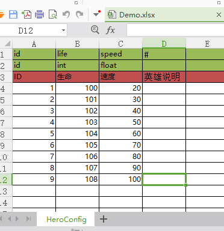

# Excel Serializer

## 用法

1. 先在Tools/Excel/Preferences配置
2. 生成cs代码
3. 生成Bytes文件

## 配置说明

| 配置参数 | 说明 |
| -------- | ----- |
| Class Namespace | 命名空间 |
| Scripts Folder | 生成代码在Assets下的目录 |
| Default Bytes Folder | 生成Bytes文件在Assets下的目录 |
| Excels Folder | Excel文件夹目录 |

## Excel格式说明

- 绿色头部: 第一行字段名, 第二行字段类型(c#类型), #改列被注释.
- Sheet名: 生成的类名(HeroConfig), 同时会生成HeroConfigList类.

> 代码中通过`heroConfigList.data`获取表格数据.

